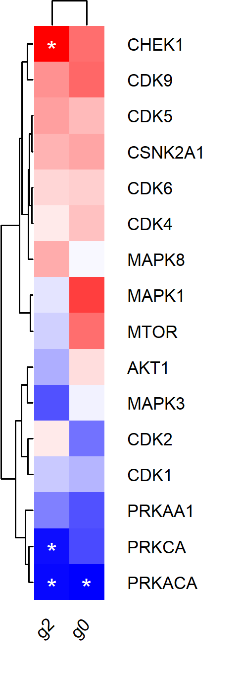

```{css, echo=FALSE}
.rmd-figure {
  width: 100%;
}

```


```{r, include=FALSE}
knitr::opts_chunk$set(
attr.source='style="max-height: 200px;"', collapse=TRUE,fig.width = 6,fig.height = 5
)
```


# Phospho-Intensity analysis

This walkthrough runs on a **simulated** MaxQuant site table shipped with the package: three conditions (`CondA`, `CondB`, `CondC`), four replicates each, with a spiked-in set of sites that respond in `CondB` and `CondC`. Every value in it -- intensities, occupancies, localisation probabilities, sequence windows, accessions -- is generated by `data-raw/make_phospho_example.R`; no measured data is distributed with proteoSE. Gene symbols are real so that GO enrichment has something to map against.

Intensities refer to the level of phosphorylation at a specific site, while occupancy refers to the proportion of protein molecules phosphorylated at that site. Note that `janitor` snake-cases every column on import, so `CondA` becomes `cond_a` downstream.

At first, intensities were used instead of occupancies because they provide a more accurate representation of the biological activity at a specific site. 


# Load data

Intensities of phosphosites are loaded as an assay of the summarized experiment. Each row contains one specific combination of phosphosite and multiplicity. 

Phosphosite multiplicity refers to the number of phosphates attached to a single amino acid residue in a protein. When a phosphoproteomic experiment identifies multiple phosphosites on the same residue, they are separated and reported as distinct entities. This is important because each phosphorylation event can have different functional consequences for the protein, and may be regulated independently.

```{r}
library(dplyr)
library(ggplot2)
library(proteoSE)
library(SummarizedExperiment)

se <- proteoSE::phos_read_in_int(
  file = system.file("extdata", "example_phospho_sites.txt", package = "proteoSE"),
  sep  = "_r"
)

```

# Describe samples

```{r}

se %>% colData() %>% as.data.frame() %>% knitr::kable()

```

# Pre-processing
## Filtering localization-prob
We filter phosphosites with low localization probability to increase the confidence in the identification of the phosphorylation site. The localization probability indicates the likelihood that the phosphorylation event occurs at a specific amino acid residue within the protein sequence, as opposed to other potential sites. Low localization probabilities indicate a higher likelihood of ambiguity in the identification of the phosphosite, which could lead to false-positive results. 
```{r}

se <- se[rowData(se)$localization_prob > 0.75]

rd <- se %>% 
  se_to_long("intensity_raw") 

p_prob <- rd %>% ggplot(aes(x = 1:nrow(.), y = sort(localization_prob)))+
  geom_line() +
  labs(y = "localization probability", x = "rank") +
  theme_proteoSE()

p_prob

p_mult <- rd %>% ggplot(aes(x = multiplicity, y = value, color = sample))+
  geom_boxplot() +
  labs(y = "log(Intensity)")+
  theme_proteoSE()

p_mult

p_n <- rd %>% filter(!is.na(value)) %>% ggplot(aes(x = condition, color = replicate, group = sample))+
  geom_point(stat = "count", position = "dodge")+
  labs(title = "Multiplicity")+
  facet_wrap(.~multiplicity, nrow = 1, scales = "free_y")+
  theme_proteoSE()

p_n

```

## Filtering missing values
In proteomics, missing values should be handled by retaining entries with only a few missing values to avoid significant data loss and preserve statistical power. These entries can still provide valuable information for analysis. The remaining missing values can be addressed using appropriate statistical techniques, such as imputation, to estimate the missing values based on observed data patterns, ensuring a comprehensive and reliable analysis of the proteomic dataset.

```{r}
# 4 replicates per condition, so perc_na = 0.5 tolerates 2 missing values in
# every group -- the same rule as the DEP::filter_missval(se, 2) this replaces.
se_filt <- proteoSE::filter_perseus(se, perc_na = 0.5, filter_mode = "each_group")

# Percentage of missing values
p_miss <- data.frame("x" = colnames(assay(se)), "y" = 100 * colSums(is.na(assay(se)))/(colSums(is.na(assay(se))) + colSums(!is.na(assay(se))))) %>% ggplot(aes(x = x, y = y)) +
  geom_bar(stat = "identity") +
  labs(y = "Missing values [%]", title = "Prior filtering missing values")+
  theme_proteoSE()

p_miss

# Percentage of missing values
p_miss2 <- data.frame("x" = colnames(assay(se_filt)), "y" = 100 * colSums(is.na(assay(se_filt)))/(colSums(is.na(assay(se_filt))) + colSums(!is.na(assay(se_filt))))) %>% ggplot(aes(x = x, y = y)) +
  geom_bar(stat = "identity") +
  labs(y = "Missing values [%]",  title = "After filtering missing values")+
  theme_proteoSE()

p_miss2
```

## normalization
Variance normalization and median centering are two common preprocessing steps in data normalization for proteomic experiments.

Variance normalization aims to equalize the variability across different proteins or peptides in a dataset. It scales the data by dividing each value by the standard deviation or variance of the corresponding feature. This adjustment helps to account for differences in abundance or intensity levels between proteins and ensures that no single feature dominates the analysis.

On the other hand, median centering involves subtracting the median value of each feature (protein or peptide) from its respective data points. This step helps to remove systematic biases and shifts in the data. Median centering makes the data symmetric around zero, allowing for better comparison and interpretation of relative differences between samples.
```{r}
# Variance normalization
se_norm_var <- se_filt %>% DEP2::normalize_vsn()

# Median normalization
se_norm <- se_norm_var
assay(se_norm) <- scale(assay(se_norm), center = TRUE)

p_norm <- DEP2::plot_normalization(se_filt, se_norm_var, se_norm) 

p_norm
```

## Imputation
By estimating missing values based on observed data patterns, imputation takes into account the relationships and dependencies within the dataset, providing a more realistic and informative view of the proteomic landscape.

In the context of imputing missing values in proteomics, drawing from a left-shifted Gaussian distribution is a common approach because it reflects the underlying assumption that missing values are likely to be lower than the observed values. 
```{r}
# Impute with "perseus" method
se_imp_perseus <- se_norm %>% proteoSE::impute_DEP2(fun = "man")

p_imp <- DEP2::plot_imputation(se_norm, se_imp_perseus)

p_imp

```

## Testing

```{r}

# Delete score column as it would lead to errors later
cols <- !grepl("score", colnames(rowData(se_imp_perseus)))

rowData(se_imp_perseus) <- rowData(se_imp_perseus)[, cols]

# Statistical testing via DEP package
se_diff <- DEP2::test_diff(se_imp_perseus, 
                          type = "manual", 
                          test = c("cond_b_vs_cond_a", "cond_c_vs_cond_a")) %>% 
  add_significance()

# Get test results in long format
se_diff_test <- test_diff_long(se_diff)


# Bar plot, n(significant) vs. multiplicity
p_multiplicity <- se_diff_test %>% filter(significant == TRUE) %>% ggplot(aes(x = multiplicity, fill = contrast))+
  geom_bar(stat = "count", position = "dodge")+
  theme_proteoSE()

p_multiplicity

# Bar plot, n(significant) vs. aa
p_aa <- se_diff_test %>% filter(significant == TRUE) %>% ggplot(aes(x = amino_acid, fill = contrast))+
  geom_bar(stat = "count", position = "dodge")+
  theme_proteoSE()

p_aa

# Beeswarm, 

cols_occupancy <- colnames(se_diff_test)[grepl("occupancy_", colnames(se_diff_test)) & 
  !grepl("(occupancy_ratio)|(occupancy_error_scale)", colnames(se_diff_test))]


p_occ <- se_diff_test %>% filter(significant == TRUE) %>% tidyr::pivot_longer(cols_occupancy, names_to = "set", values_to  ="occupancy") %>% ggplot(aes(x = set, y = occupancy, color = gsub("occupancy_(.*)_r[0-9]*", "\\1", set)))+
  labs(color = "Condition") +
  geom_jitter(width = 0.2) +
  theme_proteoSE()

p_occ


# volcanos with labels
v1 <- proteoSE::plot_volcano(se_diff, contrast = "cond_b_vs_cond_a", id_col = "name")
v2 <- proteoSE::plot_volcano(se_diff, contrast = "cond_c_vs_cond_a", id_col = "name")

v1
v2


# volcanos without labels
volcanos <- se_diff_test %>% ggplot(aes(x = diff, y = -log2(p.val), color = significant)) +
  geom_point() +
  facet_wrap(.~contrast) +
  theme_proteoSE()

volcanos

# PCA of significant sites. `n` is the number of most-variable features to use,
# so it cannot exceed however many came out significant.
se_sign <- se_diff[rowData(se_diff)$significant == TRUE, ]
p_pca <- DEP2::plot_pca(se_sign, n = min(7, nrow(se_sign)))
p_pca

# Heatmap
# k is a number of clusters, so it cannot exceed the number of significant sites
p_heatmap <- plot_heatmap_clustered(se_diff, k = min(3, nrow(se_sign)))

```

## Upset plot of significant proteins
```{r}
# Upset plot, significant proteins
sign <- se_diff_test %>% filter(significant == TRUE) %>% group_by(contrast) %>% summarize(ids = list(site_id_mult))

overlap_list <- as.list(sign$ids)
names(overlap_list) <- sign$contrast

UpSetR::upset(UpSetR::fromList(overlap_list))
```

```{r, eval = FALSE}
# Save Upset Plot as pdf
pdf(file = paste0(dir, "/", gsub(":","-",format(Sys.time(), "%Y%m%d_")), "phosphosite_significance_overlap.pdf"), onefile = FALSE, h = 5, w = 6)
UpSetR::upset(UpSetR::fromList(overlap_list))
dev.off()

```

## Look up a specific site

```{r}

# Any site id works here; take the most strongly changed one so the plot has
# something to show.
of_interest <- rowData(se_diff) %>%
  as.data.frame() %>%
  dplyr::slice_max(abs(cond_b_vs_cond_a_diff), n = 3) %>%
  dplyr::pull(name)

p_sites <- lapply(of_interest, function(x) DEP2::plot_single(se_diff, x, type = "centered"))

p_sites

```

# GO-term overrepresentation analysis
GO-terms are linked to proteins and not phosphosites. Here, we identified GO-terms that were overrepresented across proteins with at least one significant phosphosite. 

```{r}

res <- phospho_ora(se_diff)

res$plot

```

# Save results
Use this function to extract a minimized dataframe and write it to a file (if file is specified)
```{r}

res <- write_phos(se_diff, file = "")

```


# Kinase enrichment
Kinase enrichment analysis is a computational method used to identify and assess the overrepresentation or enrichment of specific kinases in a set of proteins or genes of interest. It involves analyzing the frequency of kinases within the input dataset and comparing it to a background distribution, such as the entire proteome or a reference dataset. By identifying kinases that are significantly enriched in the dataset, kinase enrichment analysis helps to gain insights into the signaling pathways and regulatory mechanisms involved in the biological processes represented by the input proteins or genes.

## ssGSEA2
SSGSEA2 (Single Sample Gene Set Enrichment Analysis 2) is an updated version of the SSGSEA algorithm. It calculates an enrichment score for each gene set based on the relative rank of genes within a sample's gene expression profile. SSGSEA2 is suitable for analyzing individual samples and allows for the assessment of gene set enrichment in a single-sample context.

This package is used differently, as it is necessary to write result files and read them back in later. Also, one needs to have the appropriate [ptm.sig.db](https://github.com/broadinstitute/ssGSEA2.0) file.

Here, we use the ptm.sig.db.all.flanking.human.v2.0.0.gmt version, as we get the necessary information directly from MaxQuant as "sequence_window". 

### significant sites
One can restrict the analysis to significantly altered phosphosites
```{r, eval = FALSE}
library(ssGSEA2)

# Create gct file from se and save it to the specified path. 
data <- se_diff[rowData(se_diff)$significant == TRUE,]
gct_int_sign <- prep_ssgsea2(data, ".")

# Run ssGSEA2 
res_sign = ssGSEA2::run_ssGSEA2(gct_int_sign$path,
                  output.prefix = "/20230403_sign_intensity",
                  gene.set.databases = "../data/ptmsigdb_v2.0.0/ptm.sig.db.all.flanking.human.v2.0.0.gmt",
                  output.directory = dir,
                  sample.norm.type = "none", 
                  weight = 0, 
                  correl.type = "rank", 
                  statistic = "area.under.RES",
                  output.score.type = "NES", 
                  nperm = 1000, 
                  min.overlap = 5, 
                  extended.output = TRUE, 
                  global.fdr = FALSE,
                  log.file = "../run.log")

# Read results
res_sign_long <- gct_to_long(file = paste0(dir, "/20230421_sign_intensity-combined.gct"))

# Plot results
res_sign_long %>% filter(fdr.pvalue < 0.1) %>% ggplot(aes(x = id.y, y = id.x, size = value, color = fdr.pvalue))+
  geom_point() +
  scale_color_gradient2(low = "blue", high = "firebrick", mid = "white") +
  theme_proteoSE()

```


### All sites
Alternatively, one can use all phosphosites. This takes a massive amount of time so better let it run over night! 
```{r, eval = FALSE}
gct_int <- prep_ssgsea2(se_diff, ".")

res = ssGSEA2::run_ssGSEA2(gct_int$path,
                  output.prefix = "20230403_intensity",
                  gene.set.databases = "../data/ptmsigdb_v2.0.0/ptm.sig.db.all.flanking.human.v2.0.0.gmt",
                  output.directory = dir,
                  sample.norm.type = "none", 
                  weight = 0, 
                  correl.type = "rank", 
                  statistic = "area.under.RES",
                  output.score.type = "NES", 
                  nperm = 1000, 
                  min.overlap = 5, 
                  extended.output = TRUE, 
                  global.fdr = FALSE,
                  log.file = "../run.log")

res_long <- gct_to_long(file = paste0(dir, "/20230421_intensity-combined.gct"))

res_long %>% filter(fdr.pvalue < 0.05) %>% ggplot(aes(x = id.y, y = id.x, size = value, color = fdr.pvalue))+
  geom_point() +
  scale_color_gradient2(low = "blue", high = "firebrick", mid = "white") +
  theme_proteoSE()

```

## KSEA-app
KSAapp (Kinase-Substrate Activity Application) is a specialized tool focused on kinase-substrate activity prediction and analysis. It integrates multiple data sources, such as phosphorylation sites and kinase-substrate interactions, to predict the activity levels of kinases and their downstream substrates. KSAapp provides insights into the potential regulatory activity of kinases and their effects on signaling networks.

### Create input datasets
```{r}

ksea_input_b <- prep_ksea(se = se_diff, contrast = "cond_b_vs_cond_a")


ksea_input_c <- prep_ksea(se = se_diff, contrast = "cond_c_vs_cond_a")

```

### Get KS_table
`KSEAapp` is not on CRAN (`remotes::install_github("casecpb/KSEAapp")`), so
the chunks in this section are shown but not run.

```{r, eval = FALSE}
library(KSEAapp)
KSData.dataset_b <- KSEA.KS_table(KSData, ksea_input_b, NetworKIN=TRUE, NetworKIN.cutoff=5)
KSData.dataset_c <- KSEA.KS_table(KSData, ksea_input_c, NetworKIN=TRUE, NetworKIN.cutoff=5)
```

### Get scores
```{r, eval = FALSE}
Scores_b <- KSEA.Scores(KSData, ksea_input_b, NetworKIN=TRUE, NetworKIN.cutoff=5)
Scores_c <- KSEA.Scores(KSData, ksea_input_c, NetworKIN=TRUE, NetworKIN.cutoff=5)
```

### Barplot
The Barplot is saved as a tiff in your working directory. To make things easier you can copy the file via the "file.copy" function.
```{r, eval = FALSE}
KSEA.Barplot(KSData, ksea_input_b, NetworKIN=TRUE, NetworKIN.cutoff=5, m.cutoff=5, p.cutoff=0.01, export = FALSE)

KSEA.Barplot(KSData, ksea_input_c, NetworKIN=TRUE, NetworKIN.cutoff=5, m.cutoff=5, p.cutoff=0.01, export = FALSE)


```

### Heatmap
The Heatmap is saved as a file in your working directory. To make things easier you can copy the file via the "file.copy" function.
```{r, eval=FALSE}

KSEA.Heatmap(score.list=list(Scores_b, Scores_c), 
             sample.labels=c("cond_b", "cond_c"), 
             stats="p.value", m.cutoff=3, p.cutoff=0.05, sample.cluster=TRUE)

file.copy("KSEA.Merged.Heatmap.png", paste0(dir, "/ksea_heatmap.png"), overwrite = TRUE)
```

```{r}

```

# Plot Sequence Logos
Sequence logos can be plotted via the *ggseqlogo* package. The input is a named list of the sequences as strings. All strings need to have the same length, so one needs to apply the center_substring first.

To plot logos for all significant sites:
```{r}
df <- se_diff_test %>% 
  filter(significant) %>% 
  mutate(sequence_window = center_substring(sequence_window, 14)) %>%
  group_by(contrast) %>%
  summarize(seqs = list(sequence_window))

names(df$seqs) = df$contrast

result = df$seqs

library(ggseqlogo)
ggseqlogo(result, seq_type='aa', method = "bit") 

```


