# A complete proteoSE run: the "U2OS stress-response" example project

This walkthrough takes one made-up project from raw search-engine output all the way to an interactive results browser, using nothing but `proteoSE` and the Bioconductor packages it builds on. Every step shows the code you would run, the console output it produces, and — where a picture helps — a real figure generated from the bundled example data.

> New to Bioconductor or the `SummarizedExperiment` class? Skim the companion slide deck (`pkgdown/assets/proteoSE_pipeline_intro.pptx`) first — it explains the one data structure that every step below reads from and writes to.
>
> The figures on this page are produced by `data-raw/make_worked_example_figures.R`; re-run it to regenerate them.

## The project

We ran a (fictional) discovery experiment in human **U2OS** cells:

-   **Ctrl** — untreated baseline
-   **TreatA** — perturbation A
-   **TreatB** — perturbation B

Five biological replicates per condition, 15 DIA-MS runs total, quantified in **Spectronaut** and exported as a protein-level report *without* a candidates (differential-testing) table — we will do the statistics ourselves. The search reported \~4000 human protein groups. As in any real DIA dataset a good fraction of values are missing, and the missingness is not purely random: low-abundance proteins drop out more often.

The two input files ship with the package:

| File | What it is |
|-------------------------|-----------------------------------------------|
| `example_project_report.tsv` | wide protein report, one row per protein group, one `…PG.Log2Quantity` column per run |
| `example_project_conditions.tsv` | run-to-condition map (`Run.Label`, `Condition`, `Replicate`, `File.Name`) |

## 0. Setup

```{r}
library(proteoSE)
library(DEP2)                 # test_diff(), add_rejections(), QC plots
library(SummarizedExperiment) # assay(), rowData(), colData(), metadata()

report_path <- system.file("extdata", "example_project_report.tsv",     package = "proteoSE")
cond_path   <- system.file("extdata", "example_project_conditions.tsv", package = "proteoSE")
```

> **Heads-up — a name clash.** DEP2 *also* exports a `plot_volcano()`, so once `library(DEP2)` is attached it masks proteoSE's. When you want proteoSE's richer volcano, call it fully qualified: `proteoSE::plot_volcano(...)`.

## 1. Import → SummarizedExperiment

`optimized_spectronaut_to_se()` reads the report and the condition setup, cleans the notoriously messy Spectronaut column names, and returns a `SummarizedExperiment`. Because we exported no candidates table, we pass `candidates = NULL`.

```{r}
se <- optimized_spectronaut_to_se(
  report         = report_path,
  conditionSetup = cond_path,
  candidates     = NULL
)

# The importer leaves the primary assay unnamed; name it so the downstream
# proteoSE helpers (which add extra assays alongside it) have something to anchor to.
assayNames(se)[1] <- "lfq_raw"

se
```

```         
class: SummarizedExperiment
dim: 4000 15
assays(1): lfq_raw
rownames(4000): TSPAN14 PPP4C ... (gene-based unique names)
rowData names(8): protein_groups genes protein_descriptions organisms ...
colnames(15): Ctrl_1 Ctrl_2 ... TreatB_4 TreatB_5
colData names(3): condition replicate sample
```

The object now holds everything as one unit: the 4000 × 15 intensity matrix (`assay`), the protein annotation (`rowData` — real gene symbols, UniProt accessions and descriptions, so downstream UniProt/GO lookups resolve), and the sample design (`colData`).

```{r}
table(colData(se)$condition)
#>   Ctrl TreatA TreatB
#>      5      5      5
```

**How many proteins did each run see?** `plot_numbers()` shows identified vs quantified counts per sample — a first sanity check that no run underperformed.

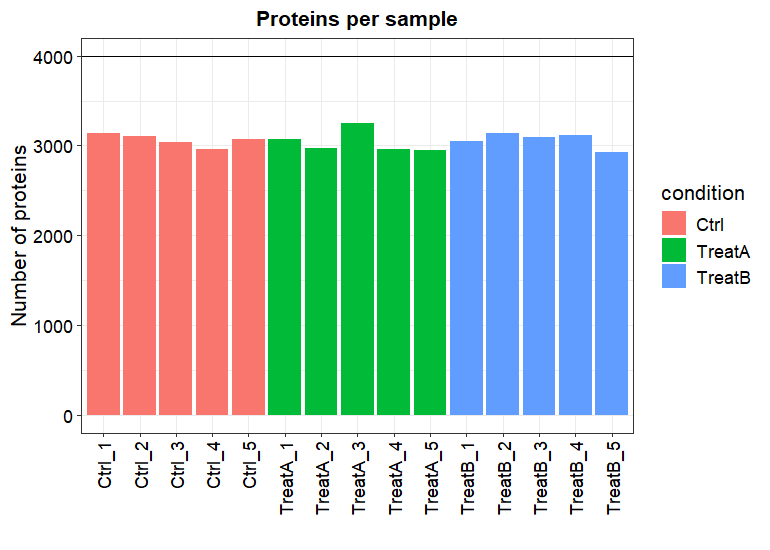

**How complete is the dataset?** `plot_frequency()` bins proteins by the number of samples they were detected in. A big "seen in all 15" bar plus a tail of partly-observed proteins is exactly what DIA data looks like.

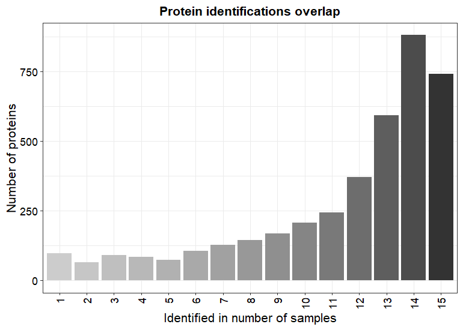

## 2. Filter out sparsely-measured proteins

Imputing a protein that was measured once out of five replicates invents data. First, look at *where* the missingness sits. `plot_missval()` draws the missing-value pattern (black = measured, light = missing); `plot_detect()` compares the intensity of proteins that are fully observed against those with missing values.

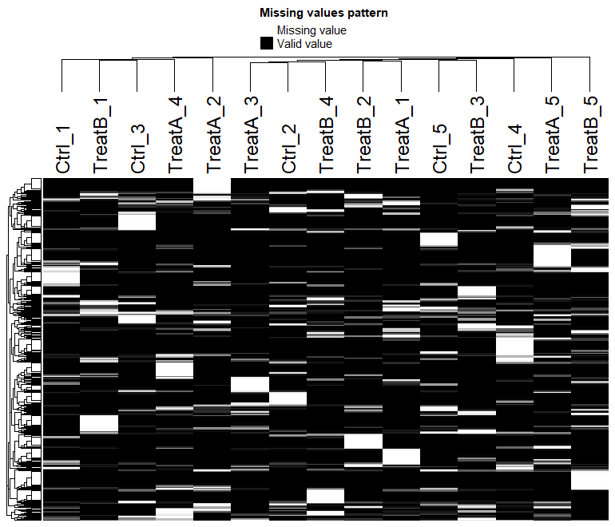

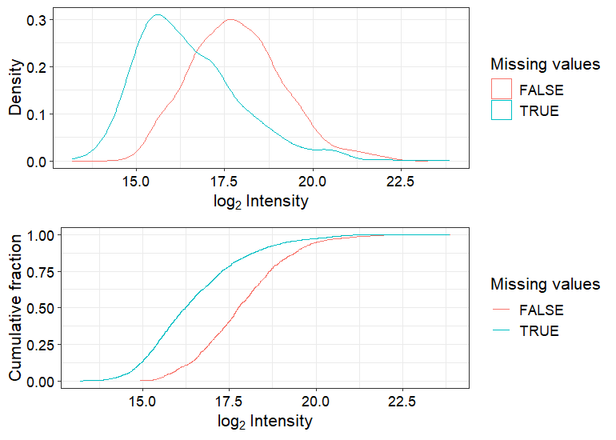

That second plot is the key diagnostic: the proteins **with** missing values (cyan) sit at systematically **lower** intensity than the complete ones. Missing here is not random — it is low-abundance dropout (MNAR), which tells us how to impute later.

`filter_perseus()` keeps only proteins seen in enough replicates. With `filter_mode = "each_group"` and `perc_na = 0.33`, a protein must have at most \~1/3 missing values **in every condition** to survive.

```{r}
se_filt <- filter_perseus(se, perc_na = 0.33, filter_mode = "each_group")
nrow(se)       #> 4000
nrow(se_filt)  #> 2837
```

We drop \~29% of protein groups — the ones too sparse to test reliably — and keep 2837.

> **Alternatives:** `filter_mode = "one_group"` (survive if well-measured in at least one condition — useful for on/off proteins) or `"total"` (a global threshold across all samples).

## 3. Impute the remaining missing values

`impute_perseus()` replaces the leftover NAs by drawing from a left-shifted, narrowed Gaussian per sample — the classic Perseus approach, and the right choice given the low-abundance dropout we just saw. Crucially, proteoSE does **not** overwrite your data: the raw matrix is preserved in its own assay, and a binary mask records which cells were imputed.

```{r}
se_imp <- impute_perseus(se_filt)
assayNames(se_imp)
#> "imputed_perseus"  "lfq_raw"  "imputed"
#     ^ main (used downstream)   ^ raw     ^ 1 = imputed, 0 = measured
```

`plot_imputation()` overlays the intensity distributions before (`se_filt`) and after (`se_imp`) imputation. The imputed panel grows a lower-intensity shoulder — the filled-in MNAR values landing where we expect them.

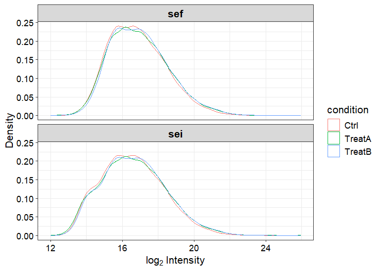

`plot_normalization()` shows per-sample boxplots so you can confirm the samples are comparable (and apply `normalize_vsn()` first if they are not).

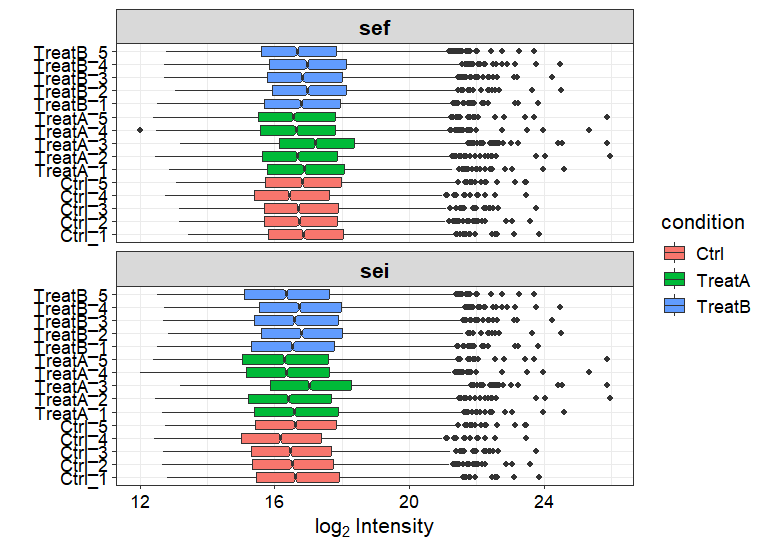

**If your missingness is mixed (some MAR, some MNAR)**, label each protein first and let DEP2 impute each type differently:

```{r}
se_rand <- add_randna(se_filt)
se_imp  <- impute_DEP(se_rand, randna = rowData(se_rand)$randna,
                       fun = "mixed", mar = "knn", mnar = "QRILC")
```

## 4. Quality control before testing

With a complete matrix we can ask whether the samples group the way the design says they should. `plot_pca()` projects the samples onto their main axes of variation; `plot_cor()` shows the sample-to-sample correlation matrix.

```{r}
DEP2::plot_pca(se_imp, indicate = c("condition"))
```

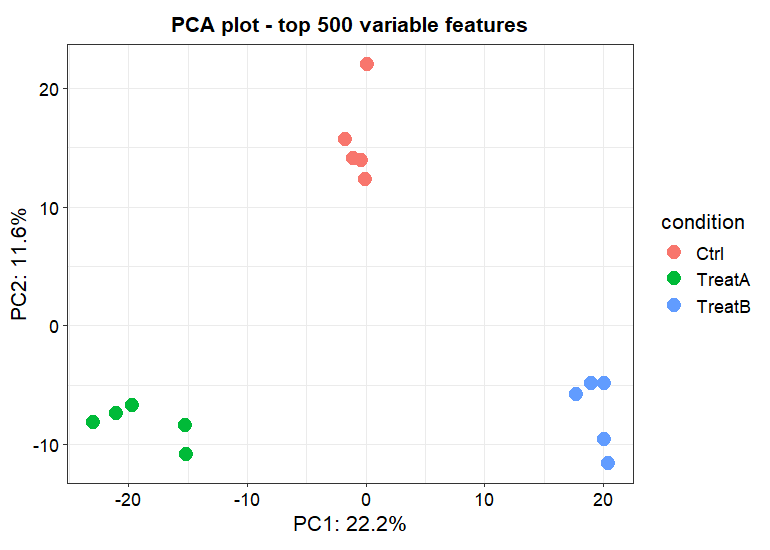

The three conditions separate cleanly — Ctrl, TreatA and TreatB each form their own tight cluster, and replicates sit together. That is the green light to test for differential abundance.


## 5. Differential abundance

Now the biology. `test_diff()` (DEP2, limma under the hood) fits the linear model; `type = "control"` tests every condition against a common reference. `add_rejections()` then flags hits at a chosen significance and fold-change threshold.

```{r}
se_diff <- test_diff(se_imp, type = "control", control = "Ctrl")
se_diff <- add_rejections(se_diff, alpha = 0.05, lfc = 1)
```

Two contrasts are produced — `TreatA_vs_Ctrl` and `TreatB_vs_Ctrl`. Counting the significant proteins (adj. p \< 0.05 **and** \|log2FC\| \> 1):

```{r}
rd <- as.data.frame(rowData(se_diff))
sum(rd$TreatA_vs_Ctrl_significant, na.rm = TRUE)  #> 92
sum(rd$TreatB_vs_Ctrl_significant, na.rm = TRUE)  #> 102
```

Out of 2837 tested proteins, 92 move in TreatA and 102 in TreatB — a realistic "most things don't change, a focused set does" result. The strongest TreatA responders:

```{r}
cols <- c("genes", "TreatA_vs_Ctrl_diff", "TreatA_vs_Ctrl_p.adj")
head(rd[order(rd$TreatA_vs_Ctrl_p.adj), cols], 8)
```

```         
    genes  TreatA_vs_Ctrl_diff  TreatA_vs_Ctrl_p.adj
  ABHD16B                 2.77             7.77e-14
  BCL2L10                 2.65             7.77e-14
    CARS1                 2.63             7.77e-14
   PTPDC1                 2.65             7.77e-14
 TMEM185A                 3.14             7.77e-14
   ZNF160                -2.52             7.77e-14
   ZNF165                 2.96             7.77e-14
   ZNF729                 3.00             7.77e-14
```

Compare conditions after testing via correlation plot:
```{r}
DEP2::plot_cor(se_imp)
```

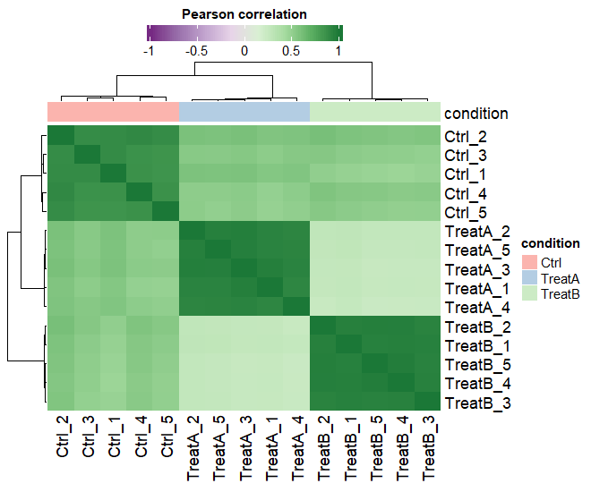

proteoSE's `plot_volcano()` renders a publication-ready volcano straight from the `rowData` results. `sig_from_column = TRUE` colours points using the `_significant` column we just added, and the top hits are labelled automatically.

```{r}
# proteoSE:: because DEP2's plot_volcano is masking it (see Setup)
vA <- proteoSE::plot_volcano(se_diff, contrast = "TreatA_vs_Ctrl",
                         sig_from_column = TRUE, top_n_sign = 12)
vA$plot_out
```

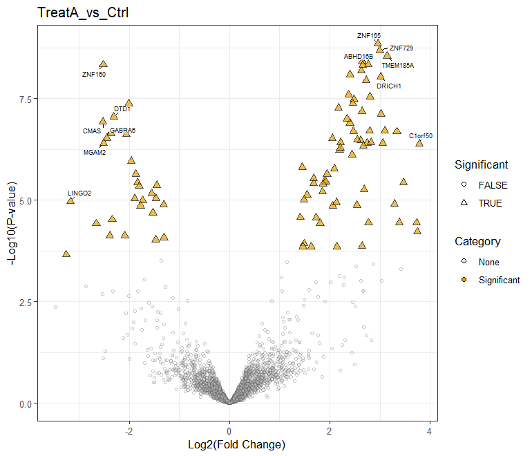

```{r}
proteoSE::plot_volcano(se_diff, contrast = "TreatB_vs_Ctrl",
                   sig_from_column = TRUE, top_n_sign = 12)$plot_out
```

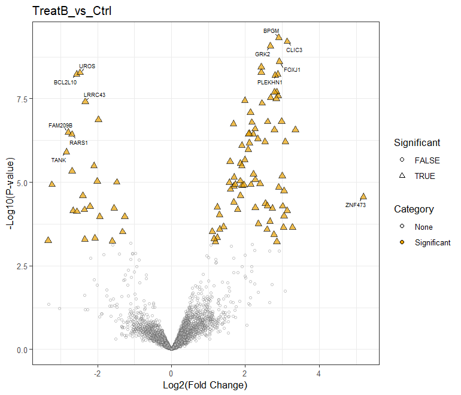

A heatmap of just the significant proteins, k-means–clustered, shows the block structure of the response — which proteins go up in which condition:

```{r}
sig_se <- se_diff[which(rowData(se_diff)$significant), ]  # 172 proteins
DEP2::plot_heatmap(sig_se, type = "centered", kmeans = TRUE, k = 4,
                   indicate = "condition")
```

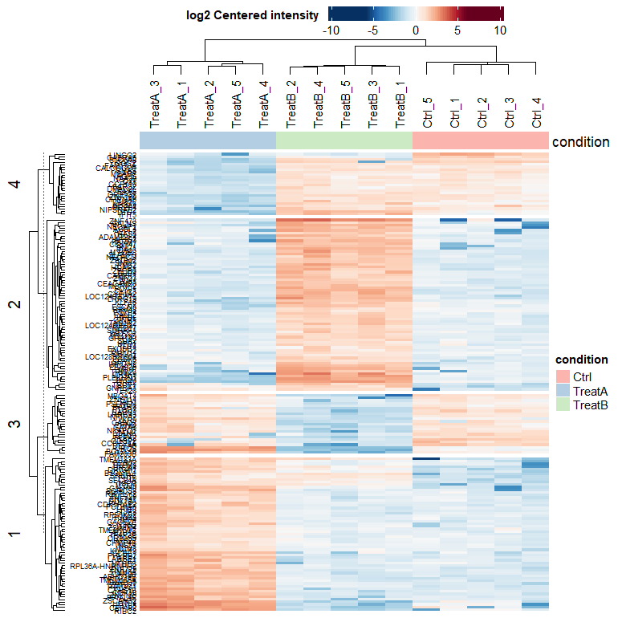

> proteoSE also wraps this as `plot_heatmap_clustered()`, which additionally returns the per-cluster protein lists — handy when you want to feed one cluster into enrichment.

## 6. Functional enrichment (GO / GSEA)

`enrich_go_se()` wraps `clusterProfiler::gseGO()`. Point it at a fold-change column and it ranks all proteins and finds GO terms enriched at the extremes. Results are stored back inside the object's `metadata`, so the SE stays your single source of truth.

```{r}
se_go <- enrich_go_se(
  se_diff,
  col_names    = "TreatA_vs_Ctrl_diff",
  OrgDb        = "org.Hs.eg.db",
  pvalueCutoff = 0.5
)

names(metadata(se_go)$GO_enrichment)
#> "TreatA_vs_Ctrl_diff"

go_res <- as.data.frame(mcols(metadata(se_go)$GO_enrichment[[1]]))
```


Plot the significant terms by normalized enrichment score, split by ontology:

```{r}
library(ggplot2)
go_res |>
  subset(p.adjust < 0.5) |>
  ggplot(aes(NES, reorder(Description, NES), colour = p.adjust)) +
  geom_point() +
  facet_wrap(~ ONTOLOGY, scales = "free_y", ncol = 1) +
  theme_bw()
```

> *No figure shown here:* in this synthetic dataset the regulated proteins were chosen at random, so there is no real GO structure to recover. On a genuine experiment this call returns enriched stress-response and protein-folding categories among the up-regulated proteins.

### Alternative: Not enrichment but overrepresentation (ORA)
Instead of taking the full list we can also test if genes in a specific set have common annotations. On the set of significantly upregulated proteins this becomes: What biological themes are more present in upregulated proteins. 
This is what I prefer over GSEA, but it stands and falls with universe selection, so the *background* against which is tested. Bad tools use the whole human proteome as background leading to heavily biased results. This might work for RNAseq, but we only identify a fraction of proteins. Only take proteins that were identified in the experiment as background!
```{r}
df_wide <- get_df_wide(se_diff)

universe <- df_wide$gene_names
sig_up_condA <- df_wide %>% dplyr::filter(TreatA_vs_Ctrl_diff > 0.58, TreatA_vs_Ctrl_p.adj < 0.05) %>% dplyr::pull(gene_names)

ora_up_condA <- clusterProfiler::enrichGO(
  gene = sig_up_condA, 
  OrgDb = "org.Hs.eg.db",
  keyType = "SYMBOL", 
  ont = "all", 
  pvalueCutoff = 0.2, 
  qvalueCutoff = 0.2,
  universe = universe)

library(ggplot2)
ora_up_condA %>% as.data.frame() %>%
  ggplot(aes(x = FoldEnrichment, 
             y = Description, 
             size = p.adjust,
             fill = ONTOLOGY)) +
  geom_point(shape = 21) +
  DEP2::theme_DEP1()

```

## 7. Explore interactively with iSEE

`se_to_isee()` registers the fold-change / p-value columns and the enrichment metadata so proteoSE's custom panels (volcano, NCBI gene links, GO table) work; `isee_mini()` launches the app.

```{r}
isee_object <- se_to_isee(se_go)
app <- isee_mini(isee_object)
# shiny::runApp(app)   # opens the interactive browser
```

From here you can click a point in the volcano, see the protein light up across replicates, follow its NCBI link, and read its enriched GO terms — all driven by the one object we have been building.

## 8. Save

A `SummarizedExperiment` is a plain R object: `save()` it and everything — assays, annotation, test results, enrichment — travels together.

```{r}
save(isee_object, file = "u2os_stress_project.rda")
# later:  load("u2os_stress_project.rda")
```

## Recap

```         
Spectronaut report ─▶ optimized_spectronaut_to_se()  →  SE (4000 × 15)
                    ─▶ plot_numbers / plot_frequency  →  identification QC
                    ─▶ filter_perseus()               →  2837 proteins
                    ─▶ plot_missval / plot_detect     →  missingness is MNAR
                    ─▶ impute_perseus()               →  no NAs, raw kept
                    ─▶ plot_pca / plot_cor            →  conditions separate
                    ─▶ test_diff() + add_rejections() →  92 / 102 hits
                    ─▶ proteoSE::plot_volcano() + heatmap →  visualise the response
                    ─▶ enrich_go_se()                 →  GO terms in metadata()
                    ─▶ se_to_isee() + isee_mini()     →  interactive app
```

One object, one narrative, from raw output to browsable result.
